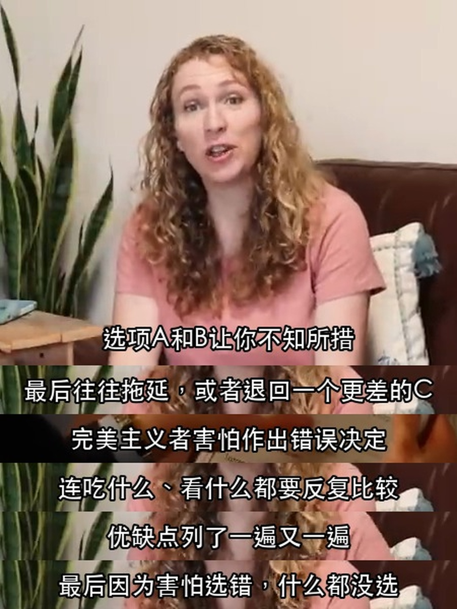
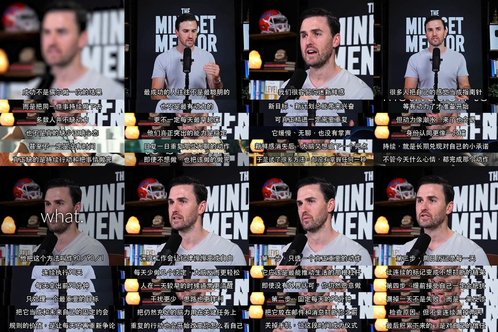

# 原生字幕拼图 Skill

[](https://github.com/chengyi-ai/native-subtitle-quote-image/actions/workflows/validate.yml)

把带有画面内嵌字幕的视频按精确时间点取帧，生成适合社交平台的 3:4 字幕拼接长图。它保留原视频画面和原生字幕，不重新绘制、翻译或覆盖文字。

本仓库同时提供：

- 可直接复制到兼容 Agent 的独立 Skill；
- 符合 Codex 插件结构的安装包；
- 自动生成带时间点的候选帧总览；
- 生成字幕区域预览、成品 JPG、时间点清单和最终总览图的本地脚本。

## Demo

下面是已有视频的实际处理成品。单张示例保留顶部主画面，并把不同时间点出现的原生字幕裁切后依次拼接成 3:4 长图；总览图展示一次多图任务的成套输出。

### 单张拼图

<p align="center">
  
</p>

### 成套输出总览

<p align="center">
  
</p>

示例图片仅用于展示 Skill 的输出效果；图片及其中出现的第三方内容不属于本仓库 MIT License 的授权范围。

## 安装

### Codex Skill Installer

在 Codex 中调用 `$skill-installer`，并让它安装下面的 Skill 目录：

```text
https://github.com/chengyi-ai/native-subtitle-quote-image/tree/main/skills/native-subtitle-quote-image
```

### 手动安装到 Codex

```bash
git clone https://github.com/chengyi-ai/native-subtitle-quote-image.git
mkdir -p ~/.codex/skills
cp -R native-subtitle-quote-image/skills/native-subtitle-quote-image ~/.codex/skills/
```

重新打开 Codex 任务后即可使用 `$native-subtitle-quote-image`。

### 其他 Agent

该 Skill 使用开放的 Agent Skills 目录格式。把 `skills/native-subtitle-quote-image/` 复制到目标 Agent 支持的 Skills 目录；具体目录和启用方式以目标 Agent 的说明为准。

## 依赖

- Python 3.10+
- Pillow
- FFmpeg，或可提供 FFmpeg 的 `imageio-ffmpeg`

```bash
python3 -m pip install -r skills/native-subtitle-quote-image/requirements.txt
```

## 使用

在 Agent 中输入：

```text
使用 $native-subtitle-quote-image，把这个带内嵌中文字幕的视频做成原生字幕拼图。
```

Agent 会先检查视频字幕与裁切区域，再选择字幕稳定出现的时间点，最后生成：

- 逐张 3:4 JPG；
- `原生字幕时间点.json`；
- `final_contact_sheet.jpg` 总览图。

## 本地脚本

先生成带时间点的候选帧总览，减少反复试时间点：

```bash
python3 skills/native-subtitle-quote-image/scripts/native_subtitle_stitch.py sample VIDEO \
  --start 30 --end 120 --interval 5 --out candidate-contact-sheet.jpg
```

不传 `--start`、`--end` 和 `--interval` 时，脚本会在整段视频中自动均匀抽取最多 24 帧。确认字幕区域和时间点后，再使用 `band` 与 `render`；完整参数可通过 `--help` 查看。

脚本默认拒绝覆盖已有图片。确认需要替换当前输出时，显式添加 `--overwrite`。

## 常见问题

### 怎么判断视频是不是烧录字幕？

- 关闭播放器的 CC/字幕开关后，字幕仍留在画面里；
- 任意截取一帧，字幕会直接出现在图片像素中；
- 如果字幕可以单独关闭、切换语言或下载为 `.srt`，通常是外挂字幕，不属于本 Skill 的输入。

### 带烧录字幕的视频从哪里来？

优先使用自己拍摄并添加字幕的视频、自己已获得授权的素材，或明确允许再利用的公开视频。最稳定的方式是先在剪辑软件中把字幕烧录进自己有权使用的视频，再交给本 Skill 取帧。搜索现成素材时可以使用“硬字幕”“内嵌字幕”“中文字幕”等关键词，但下载和公开生成图片前仍需确认使用权。

### 为什么没有自动识别或重绘字幕？

这个 Skill 的目标是保留原视频画面与原生字幕。OCR、翻译、外挂字幕合成和重新绘字属于不同工作流，刻意不在本仓库内混合实现。

## 项目验证

```bash
python3 scripts/validate_repo.py
python3 -m unittest discover -s tests -v
```

每次推送和 Pull Request 也会通过 GitHub Actions 自动运行相同检查。

## 适用边界

- 只适用于字幕已经烧录在视频画面中的素材。
- 外挂字幕、自动翻译或重新绘制字幕不属于这个 Skill 的工作范围。
- 使用者应确保自己有权处理和发布输入视频及生成画面。

## 开源许可

代码与 Skill 指令采用 [MIT License](LICENSE)。输入视频、生成图片及其中出现的第三方内容不因本许可证获得额外授权。
