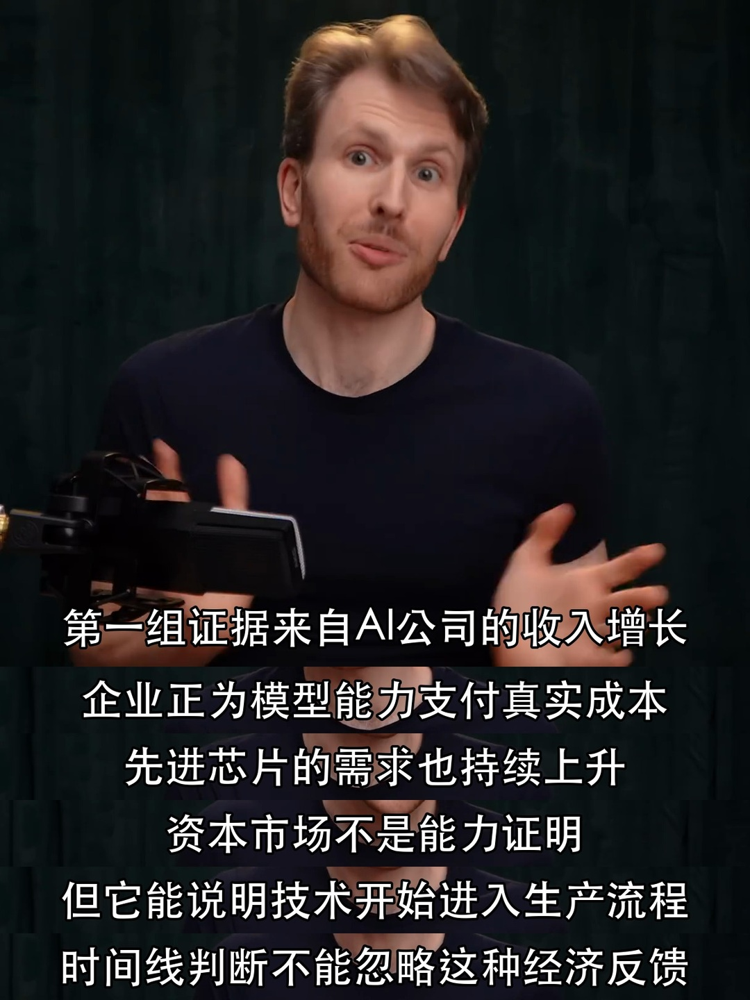
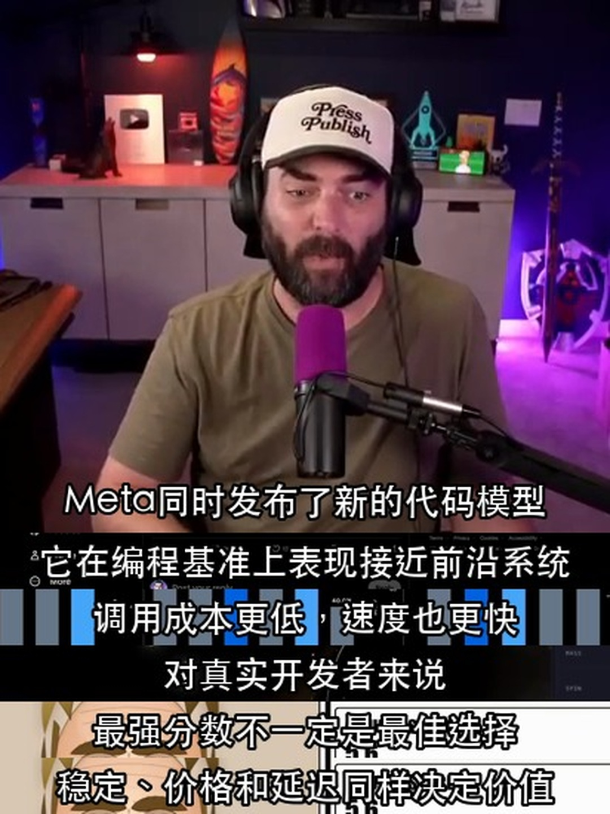

<div align="center">
  

  <h1>Native Subtitle Quote Image</h1>

  <p><strong>Turn real video frames into compact 3:4 subtitle quote images</strong></p>
  <p><em>Native subtitles are never redrawn. Scripted subtitles are never presented as native.</em></p>

  <p><a href="README.md">中文</a> · English</p>

  <p>
    <a href="https://github.com/chengyi-ai/native-subtitle-quote-image/actions/workflows/validate.yml"></a>
    <a href="https://github.com/chengyi-ai/native-subtitle-quote-image/releases"></a>
    <a href="https://github.com/chengyi-ai/native-subtitle-quote-image/stargazers"></a>
    <a href="LICENSE"></a>
  </p>

  <p>
    
    
    
  </p>

  <p>
    <a href="#what-it-does">What it does</a> ·
    <a href="#two-subtitle-modes">Two modes</a> ·
    <a href="#complete-workflow">Workflow</a> ·
    <a href="#demo">Demo</a> ·
    <a href="#install">Install</a> ·
    <a href="#use">Use</a> ·
    <a href="#scope">Scope</a> ·
    <a href="#validation">Validation</a> ·
    <a href="https://github.com/chengyi-ai/native-subtitle-quote-image/issues">Feedback</a>
  </p>
</div>

---

## What it does

This open Agent Skill starts with a local video or an online video the user has the right to process. It handles source acquisition, transcript-assisted discovery, topic and quote selection, exact frame calibration, compact collage rendering, and per-image QA.

It supports two explicitly separated subtitle modes. Native mode preserves the video pixels unchanged. Scripted mode draws reviewed timestamped copy onto real video frames and identifies that text as post-produced subtitles.

The repository includes:

- a standalone Skill for compatible agents;
- a Codex-compatible plugin package;
- a URL workflow covering `yt-dlp`, Deno/Node, and auxiliary subtitle tracks;
- a transcript-to-topic method that always returns to real video frames and timestamps;
- candidate-frame contact sheets with timestamps;
- local tools for focused frame candidates, subtitle-band previews, native or scripted 3:4 JPGs, timestamp manifests, and contact sheets;
- a compact visual style guide that fixes oversized subtitle strips, excessive spacing, and weak hero-frame hierarchy;
- a read-only environment checker for local, URL, and CJK scripted-subtitle modes.

## Two subtitle modes

| Mode | Use it when | Text source in the output | CLI |
|---|---|---|---|
| **Native subtitles** | Subtitles remain in screenshots after the player's CC control is disabled, and the user wants the original subtitles | Video pixels only; no OCR redraw, translation, or rewriting | `render` |
| **Scripted subtitles** | Reviewed quotes, translations, or points should be drawn onto real frames using the demo layout | Reviewed `lines[].text`, explicitly identified as post-produced copy | `render-script` |

If a user requests native subtitles but the video only has a switchable track, the agent must explain the limitation. It may switch to scripted mode only after the user agrees.

## Complete workflow

```text
Local video / YouTube URL
        ↓
yt-dlp obtains video, metadata, and auxiliary subtitle tracks (URL mode)
        ↓
Inspect real frames and distinguish burned-in subtitles from separate tracks
        ↓
Subtitle track or Whisper builds a timestamped content index (optional)
        ↓
Video analysis / topic / writing Skills propose themes (optional)
        ↓
Lock native or scripted subtitle mode
        ↓
Return to real frames and calibrate timestamps and hero frames
        ↓
Manifest / lines JSON → compact 3:4 render → per-image QA
```

The central rule is: **native-mode text comes only from video pixels; scripted-mode text comes only from reviewed JSON and must never be presented as native.**

Three modes are supported:

1. **Local finished-video mode**: select quotes, extract frames, and render from a local video. `yt-dlp` is unnecessary.
2. **Full URL mode**: use `yt-dlp` to obtain a video, metadata, and auxiliary timeline the user has the right to process, then choose a subtitle mode.
3. **Content-production mode**: read the video, select topics, write an article or post, and create subtitle visuals. Upstream content Skills help with analysis; this Skill remains the source of truth for timestamps, real frames, subtitle-source labels, and QA.

### Component layers

| Component | Local mode | URL mode | Role |
|---|---:|---:|---|
| `native-subtitle-quote-image` | Required | Required | Frame selection, cropping, collage rendering, and final QA |
| Python 3.10+ | Required | Required | Runs the Skill scripts |
| Pillow | Required | Required | Cropping, collage composition, and JPG export |
| `imageio-ffmpeg` or FFmpeg | Required | Required | Video decoding and exact frame extraction |
| `yt-dlp` | Not needed | Required | Online video, metadata, and subtitle-track acquisition |
| Deno, or explicitly enabled Node.js | Not needed | Required for full YouTube support | Full YouTube format extraction |
| Whisper / speech-to-text Skill | Optional | Optional | Builds a timeline when no subtitle track is available |
| CJK font | Required for CJK scripted copy | Required for CJK scripted copy | Draws Chinese, Japanese, or Korean copy; not needed in native mode |
| Topic, writing, or video-understanding Skill | Optional | Optional | Proposes themes and produces companion content from the transcript |

Detailed implementation guides (Chinese; the commands are language-independent):

- [URL acquisition, yt-dlp, Deno/Node, and timelines](skills/native-subtitle-quote-image/references/yt-dlp-and-transcripts.md)
- [End-to-end topic selection, frame calibration, rendering, and QA](skills/native-subtitle-quote-image/references/end-to-end-workflow.md)
- [Compact hero, subtitle-strip density, and visual QA rules](skills/native-subtitle-quote-image/references/visual-style.md)

## Demo

All images below are **scripted-subtitle mode** examples made from real video frames and reviewed Chinese copy. They demonstrate frame selection, hero height, strip density, and visual QA; they do not imply that the source frames originally contained these Chinese subtitles.

### Single scripted-subtitle collage

<p align="center">
  
</p>

### Output overview

<p align="center">
  
</p>

### More complete examples

Both images retain their original 1080×1440 resolution. README only controls their display width; the image files are not downscaled.

<p align="center">
  
  
</p>

The same principle applies across different source programs: keep the hero frame dominant, make subtitle strips compact and continuous, and avoid meaningless vertical space between lines. With one hero and four strips, the default is about 70% hero height, 7.5% per strip, and zero spacing.

> The demo images are included only to show the Skill's output. The MIT License does not grant rights to third-party content visible in those images.

## Install

### Codex Skill Installer

Ask `$skill-installer` in Codex to install this Skill directory:

```text
https://github.com/chengyi-ai/native-subtitle-quote-image/tree/main/skills/native-subtitle-quote-image
```

### Manual Codex install

```bash
git clone https://github.com/chengyi-ai/native-subtitle-quote-image.git
mkdir -p ~/.codex/skills
cp -R native-subtitle-quote-image/skills/native-subtitle-quote-image ~/.codex/skills/
```

Open a new Codex task, then invoke `$native-subtitle-quote-image`.

### Install core dependencies

```bash
python3 -m pip install -r skills/native-subtitle-quote-image/requirements.txt
python3 skills/native-subtitle-quote-image/scripts/check_environment.py
```

For Chinese, Japanese, or Korean scripted copy, also check for a CJK font:

```bash
python3 skills/native-subtitle-quote-image/scripts/check_environment.py --script-mode
```

### URL mode

URL mode also needs `yt-dlp` and a JavaScript runtime. yt-dlp currently recommends Deno. An existing Node.js installation also works when `--js-runtimes node` is added to yt-dlp commands.

```bash
python3 -m pip install -U "yt-dlp[default]"
python3 skills/native-subtitle-quote-image/scripts/check_environment.py --url-mode
```

The checker never installs or changes software. When something is missing, the agent should explain why it is needed and ask before installing it.

### Other agents

The Skill uses the open Agent Skills directory format. Copy `skills/native-subtitle-quote-image/` into the Skills directory supported by your agent and follow that agent's activation instructions.

## Use

Prompt your agent with:

```text
Use $native-subtitle-quote-image to turn this video with burned-in subtitles into native subtitle quote images.
```

For a URL:

```text
Use $native-subtitle-quote-image with this YouTube URL. Check download rights and burned-in subtitles first, then select three useful themes, create native subtitle collages, and inspect every image.
```

For a content pipeline:

```text
Use the timestamped transcript to choose topics and draft the article, then use $native-subtitle-quote-image to select real frames for each core point. Choose native or scripted subtitle mode explicitly and do not mix them.
```

To recreate the demo layout from reviewed copy:

```text
Use $native-subtitle-quote-image in scripted-subtitle mode. Draw this reviewed timestamped Chinese copy onto real video frames, create compact 3:4 images, and visually inspect every result.
```

The workflow checks source rights, subtitle type, and candidate frames, then delivers:

- 3:4 JPG files;
- `原生字幕时间点.json` for native mode, or a `lines` JSON for scripted mode;
- `final_contact_sheet.jpg` for multi-image deliveries.

### Local CLI

Generate a timestamped candidate-frame sheet before choosing exact frames:

```bash
python3 skills/native-subtitle-quote-image/scripts/native_subtitle_stitch.py sample VIDEO \
  --start 30 --end 120 --interval 5 --out candidate-contact-sheet.jpg
```

When `--start`, `--end`, and `--interval` are omitted, the CLI samples up to 24 frames across the full video. Run `--help` for all options.

When a transcript already provides candidate timestamps, generate before/middle/after frames around each point:

```bash
python3 skills/native-subtitle-quote-image/scripts/native_subtitle_stitch.py sample VIDEO \
  -t 61.2 -t 68.9 -t 74.5 -t 82.0 -t 88.4 \
  --around 0.8 --out focused-candidates.jpg
```

### Native-subtitle render

Preview the subtitle crop with `band`, then render a manifest:

```bash
python3 skills/native-subtitle-quote-image/scripts/native_subtitle_stitch.py band VIDEO \
  -t 61.2 --band-top 0.78 --band-bottom 0.96 --out band-preview.jpg

python3 skills/native-subtitle-quote-image/scripts/native_subtitle_stitch.py render VIDEO \
  --manifest manifest.json --out-dir output-v1 \
  --aspect 3:4 --width 1440 \
  --band-top 0.78 --band-bottom 0.96
```

### Scripted-subtitle render

Every `text` value must be reviewed, single-line copy, and every `t` must be a strictly increasing real timestamp:

```json
{
  "lines": [
    {"t": 61.6, "text": "First reviewed line"},
    {"t": 69.3, "text": "Second reviewed line"},
    {"t": 75.0, "text": "Third reviewed line"},
    {"t": 82.4, "text": "Fourth reviewed line"},
    {"t": 88.8, "text": "Fifth reviewed line"}
  ]
}
```

```bash
python3 skills/native-subtitle-quote-image/scripts/native_subtitle_stitch.py render-script VIDEO \
  --script script.json --out output.jpg --aspect 3:4 --width 1440
```

The script tries common system CJK fonts. If none is found, pass `--font /path/to/font.ttc`. Split overly long copy instead of forcing it into an unreadably small font.

Both renderers automatically adjust hero height to the number of subtitle strips. A common layout with one hero and four strips uses roughly 70% of the height for the hero and keeps strip spacing at zero. In native mode, preview the `0.78–0.96` source-height band first for one-line subtitles. See the [compact visual style guide](skills/native-subtitle-quote-image/references/visual-style.md) for the full rules.

Existing images are protected by default. Add `--overwrite` only when replacing the current output is intentional.

## Scope

### Good input

- Native mode: the subtitle remains in the frame pixels after the player's CC control is turned off.
- Scripted mode: reviewed copy and verifiable timestamps are available for post-produced text on real frames.
- You have the right to process and publish the video and generated frames.

### Out of scope

- A native-subtitle request when only a switchable or downloadable subtitle track exists.
- Unreviewed scripted copy or translations, or quotes invented beyond the source.
- Turning low-resolution source footage into genuinely high-resolution footage.

Native and scripted subtitles remain separate workflows. Native mode never changes the words; scripted mode never claims that post-produced text was already in the source frame. Both use real timestamps and require visual QA. Use footage you created, licensed material, or public video that clearly permits reuse. Confirm usage rights before publishing generated images.

## Validation

```bash
python3 scripts/validate_repo.py
python3 -m unittest discover -s tests -v
python3 skills/native-subtitle-quote-image/scripts/check_environment.py
python3 skills/native-subtitle-quote-image/scripts/native_subtitle_stitch.py --help
python3 skills/native-subtitle-quote-image/scripts/native_subtitle_stitch.py render-script --help
```

GitHub Actions runs the checks on Python 3.10 and 3.13 for every push and pull request.

## License

Code and Skill instructions are released under the [MIT License](LICENSE). No additional rights are granted for input videos, generated images, or third-party content appearing in them.
